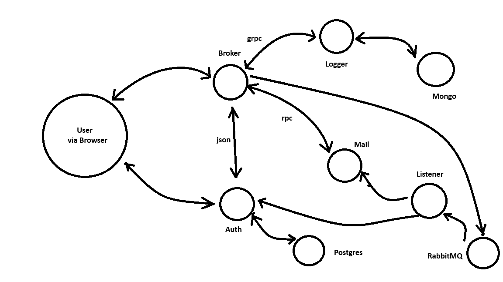

Microservices in Golang

Microservices: 
    - Client: server web page,  
    - Authorization: validate user, 
    - Broker: distribute user action to appropriate services, 
    - Logger: store logs in mongo db, 
    - Mail, 
    - Listener: take event from rabbitmg queue 

breeders: mini project, mainly for practising design patterns  
ecom: mini project, e-commerce application to store information about
user's orders 